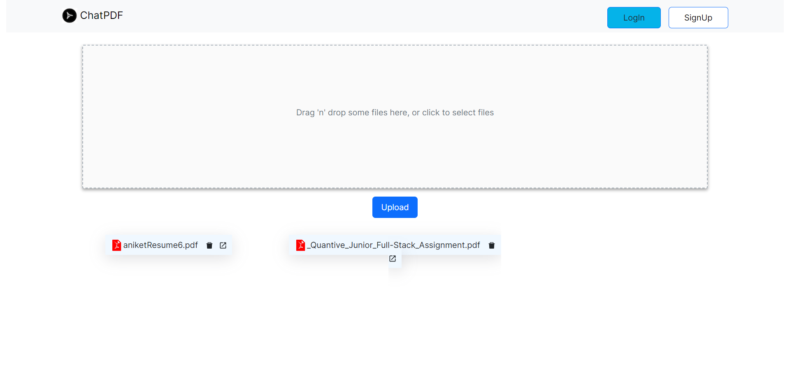

# Chat PDF

  
</p

Upload any pdf file and ask questions from that pdf. 

ChatPDF generates embeddings from OpenAI embedding model and stores them in Pinecone Vector database. 

## Overview
   This app uses LangChain, Next.js, Pinecone, MongoDB, and Firebase to build a chat interface that allows users to interact with a given document.

  LangChain is a framework that makes it easier to build scalable AI/LLM apps and chatbots.
  Pinecone is a vectorstore for storing embeddings and your PDF in text to later retrieve similar docs.
  Next.js is a React framework for building server-rendered web applications.
  MongoDB is a NoSQL database that is used to store the app's data.
  Firebase is a backend-as-a-service platform that is used to store the app's files.

## Architecture
   The app has the following architecture:

  The user uploads a document to the app.
  The app uses LangChain to generate embeddings for the document.
  The app stores the embeddings in Pinecone.
  When the user asks a question about the document, the app uses LangChain to query the embeddings in Pinecone and generate a response.
  The app stores the uploaded documents in Firebase.

## Pre-requisites to run this project

1. OpenAI API Key
2. Pinecone Database ENV and KEY
3. MongoDB cluster username and password
4. Firebase storage

## Steps to run this project

1. Clone the repo
2. Run `npm install` to install all the dependencies
3. Create a `.env'
4. Update the OpenAI, Pinecone keys, MongoDB creds 
5. Run `npm run dev` to start the project

## Challenges

 1.Selecting right tech-stack for app is challenge for me, I used NextJS for frontend and backend also ,because NextJS provides build in features that makes easy and fast to code
 2.Pinecone free tier limitation: Pinecone allows only one index for free, so I needed to delete the existing index every time a new document was uploaded and append the new vector index for the new data. This was a big challenge

### Tech stack

- NextJS
- React-Bootstrap
- LangChain
- MongoDB
- Pinecone (Vector DB)
- OpenAI Models - Embedding and Completion

